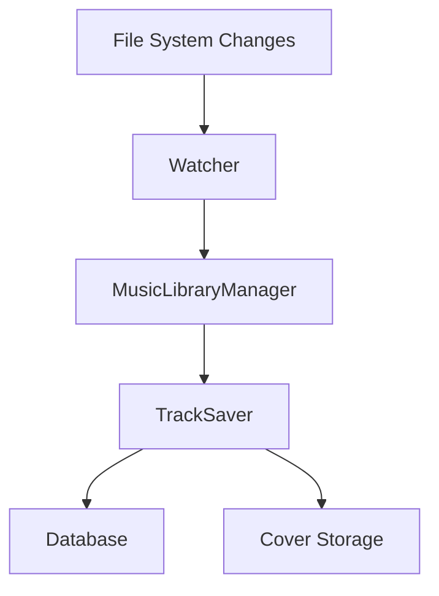

# My music server

Just a music server, so chill, even the performance is taking a break. (it's not that bad, though).
Yep, **SKILL ISSUE**!


Sorry if it's not working for you (but normally it should work if you have `node` and `pnpm`).
JK, I'll try to make it work for everyone (one day).

> At this point I don't even know why am I writing this, I'm the only one who's gonna use this anyway.

## Features

- 🎵 Supports multiple audio formats (MP3, FLAC, WAV, OGG)
- 🔄 Real-time file system monitoring
- 🎨 Album artwork management
- 📊 Metadata extraction and processing
- 🗃️ Efficient batch processing
- 🔍 Smart change detection
- 📝 Prisma-based database management

## System Architecture

### Core Components

#### 1. Music Library Manager
- Event-driven architecture using Node.js EventEmitter
- Handles file watching and track processing
- Manages metadata extraction and storage

#### 2. Track Saver
- Manages database operations
- Handles album artwork storage
- Processes metadata updates
- Maintains data consistency

### Data Flow



## Technical Stack

- **Runtime**: Node.js
- **Language**: TypeScript
- **Database ORM**: Prisma
- **Metadata Parser**: music-metadata
- **File Handling**: Node.js fs module
- **Concurrency**: p-limit for batch processing
- **Unique IDs**: UUID v5

## Database Schema

```prisma
model Track {
  id        String   @id
  title     String
  path      String   @unique
  dateAdded DateTime
  album     Album    @relation(fields: [albumId], references: [id])
  artists   Artist[]
}

model Album {
  id        String   @id
  title     String
  coverPath String?
  tracks    Track[]
  artists   Artist[]
}

model Artist {
  id     String  @id
  name   String
  albums Album[]
  tracks Track[]
}
```

## Key Features Implementation

### File Watching
```typescript
initWatcher(): void {
  this.watcherCleanup = startWatcher();
}
```

### Batch Processing
```typescript
private readonly BATCH_SIZE = 50;
// Processes files in batches for optimal performance
```

### Metadata Processing
- Extracts audio metadata using music-metadata
- Processes album artwork
- Manages artist and album relationships

### Change Detection
- Uses SHA-256 hashing for directory contents
- Efficiently detects and processes file changes

## Installation

```bash
# Clone the repository
git clone [repository-url]

# Install dependencies
npm install

# Set up environment variables
cp .env.example .env

# Run database migrations
pnpm db:push

# Start the application
pnpm dev
```

## API Usage

The system provides both REST and GraphQL APIs for:
- Track management
- Metadata retrieval
- Album artwork access
- Audio streaming

### TODO

- [ ] Stats
- [ ] Refactor the code, because it's a mess. I just want to make it work first. (I might never do this, **AGAIN, SKILL ISSUE**)
- [ ] Add more query options, allow sorting, filtering, etc
- [ ] Improve the performance, yes I know it's should be the first thing to do, but as I said, it's not that bad
- [ ] Other stuffs that I haven't thought of yet
